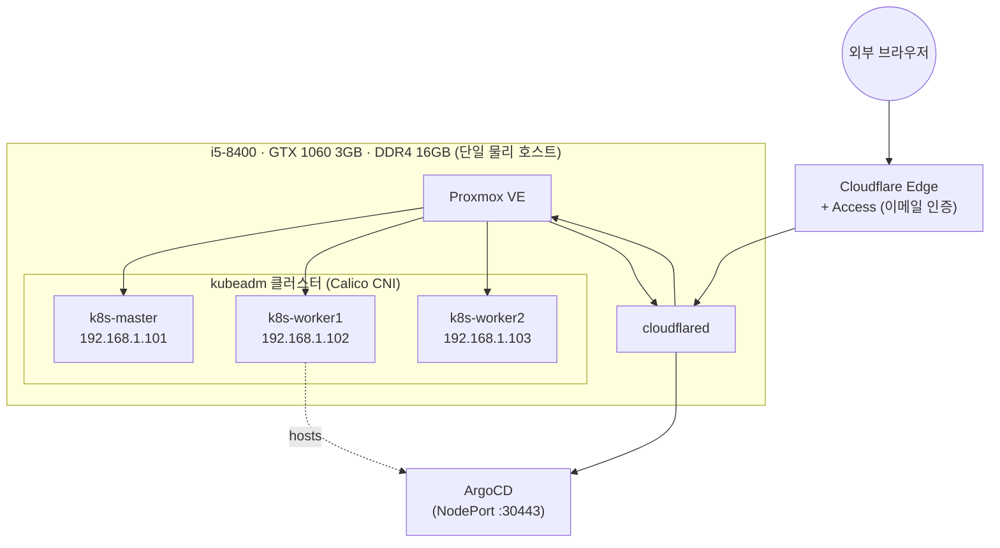

# Proxmox Homelab — AI 워크로드를 위한 셀프서비스 플랫폼

유휴 데스크탑 한 대에 Proxmox를 깔고, 그 위에 kubeadm 클러스터를 직접 구성해서 GitOps로
운영하는 홈랩입니다. 목표는 리소스가 제한된 온프렘 환경에서 GPU 기반 워크로드(RAG +
llama.cpp)를 안정적으로 서빙하는 플랫폼을 만들고, 그 과정의 아키텍처 결정과 장애 대응을
문서화하는 것입니다.

## 왜 이 프로젝트인가

GitOps, CI/CD, 서비스 메시, RAG 서빙까지 하고 싶은 게 많았는데, 이걸 각각 따로 얹으면
16GB RAM으로는 물리적으로 동시에 못 돌리고, "이것저것 넣어본 홈랩"이라는 인상만 남아
하나의 이야기로 설명하기 어려워집니다. 그래서 방향을 하나로 좁혔습니다 — **플랫폼
엔지니어링을 방법론으로, AI 워크로드 서빙을 그 플랫폼이 다루는 대표 워크로드로** 삼아서,
"제한된 리소스 안에서 어떻게 운영했는가"를 중심 줄기로 잡았습니다.

## 아키텍처

브라우저 → Cloudflare Access(인증) → Cloudflare Tunnel → Proxmox 호스트에서 상시 실행되는
`cloudflared` → 내부 서비스(Proxmox 웹UI, ArgoCD) 순서로 연결됩니다. 인바운드 포트를 전혀
열지 않는 구조라 집 네트워크의 이중 NAT 문제를 우회합니다.

## 하드웨어

| 항목 | 스펙 |
|---|---|
| CPU | i5-8400 |
| GPU | GTX 1060 3GB (미사용, Phase 2에서 passthrough 예정) |
| RAM | DDR4 16GB → 20GB 증설 예정 |
| 디스크 | Samsung 970 EVO NVMe 250GB |

신품 미니PC나 클라우드 크레딧이 아니라 유휴 데스크탑을 재활용했고, 이후 모든 설계
판단(CNI 선택, RAM 증설 방식, 서비스 배치 위치 등)이 이 리소스 제약을 전제로 이뤄졌습니다.

## 진행 현황

- [x] **Phase 0** — Proxmox 설치, cloud-init 템플릿, kubeadm 3노드 클러스터(Calico)
- [x] **Phase 1(일부)** — ArgoCD(Helm 설치, NodePort 전환), Cloudflare Tunnel 원격 접근
- [ ] Phase 1 나머지 — Git 레포 매니페스트 구조, Jenkins(CI)
- [ ] Phase 2 — llama.cpp GPU 서빙 (PCI Passthrough)
- [ ] Phase 3 — RAG 마이크로서비스화, 서비스 메시
- [ ] Phase 4 — 관측성(Prometheus/Grafana/Loki), 장애 주입 및 포스트모템
- [ ] Phase 5 — Tailscale로 AWS 하이브리드 연결

Phase별 상세 계획은 [`md/ROADMAP.md`](md/ROADMAP.md)에 정리되어 있습니다.

## 기술적 의사결정

전체 트레이드오프는 [`md/tradeoffs.pdf`](md/tradeoffs.pdf)에 12개 항목으로 정리되어
있고, 그중 몇 가지만 추리면:

- **kubeadm vs k3s** — k3s가 더 가볍지만, 실무에서 더 많이 쓰이는 kubeadm으로 직접
  구성하는 경험을 남기기 위해 kubeadm을 선택했습니다.
- **Calico vs Flannel** — 나중에 서비스 간 트래픽을 NetworkPolicy로 제어할 계획이 있어
  Flannel 대신 Calico로 구성했습니다.
- **cloudflared를 Proxmox 호스트에 직접 설치** — 원칙적으로는 하이퍼바이저에 애플리케이션을
  얹지 않는 게 맞지만, 전용 VM을 새로 띄우는 오버헤드(1~2GB)가 부담스러운 상황이라
  의도적으로 트레이드오프를 감수했습니다.
- **RAM 증설 시 용량 우선** — 가격 문제로 기존보다 느린 DDR4 모듈을 검토하면서도, VM
  여러 개를 운영하는 용도에서는 속도보다 용량(OOM 회피)이 중요하다고 판단했습니다.

## 문서

| 파일 | 내용 |
|---|---|
| [`md/ROADMAP.md`](md/ROADMAP.md) | 방향성과 Phase별 계획 |
| [`md/PROGRESS.md`](md/PROGRESS.md) | 실제 진행 기록, 겪은 이슈와 해결 과정 |
| [`md/CONSIDERATIONS.md`](md/CONSIDERATIONS.md) | 논의했지만 아직 실행 전인 항목 (Longhorn, Jenkins VM 등) |
| [`md/proxmox-homelab-troubleshooting.md`](md/proxmox-homelab-troubleshooting.md) | 하드웨어/설치 단계 트러블슈팅 |
| [`md/proxmox-vm-setup-guide.pdf`](md/proxmox-vm-setup-guide.pdf) | Proxmox 설치 + cloud-init 템플릿/VM 구성 가이드 |
| [`md/k8s-setup-guide.pdf`](md/k8s-setup-guide.pdf) | kubeadm 클러스터 + ArgoCD 설치 가이드 |
| [`md/cloudflare-tunnel-guide.pdf`](md/cloudflare-tunnel-guide.pdf) | Cloudflare Tunnel 원격 접근 구성 가이드 |
| [`md/tradeoffs.pdf`](md/tradeoffs.pdf) | 전체 기술적 의사결정 모음 |

## 다음 계획

당장은 Git 레포 매니페스트 구조를 설계하고 Jenkins를 CI 전용으로 붙이는 게 남았고, 이후
GPU 워크로드(Phase 2)로 넘어갑니다. 16GB(→20GB) RAM으로는 모든 스택을 동시에 켜둘 수 없어서,
필요한 스택만 켜고 나머지는 스케일다운하는 방식으로 운영합니다 — 이 우선순위 판단 자체도
계속 기록해나갈 예정입니다.
